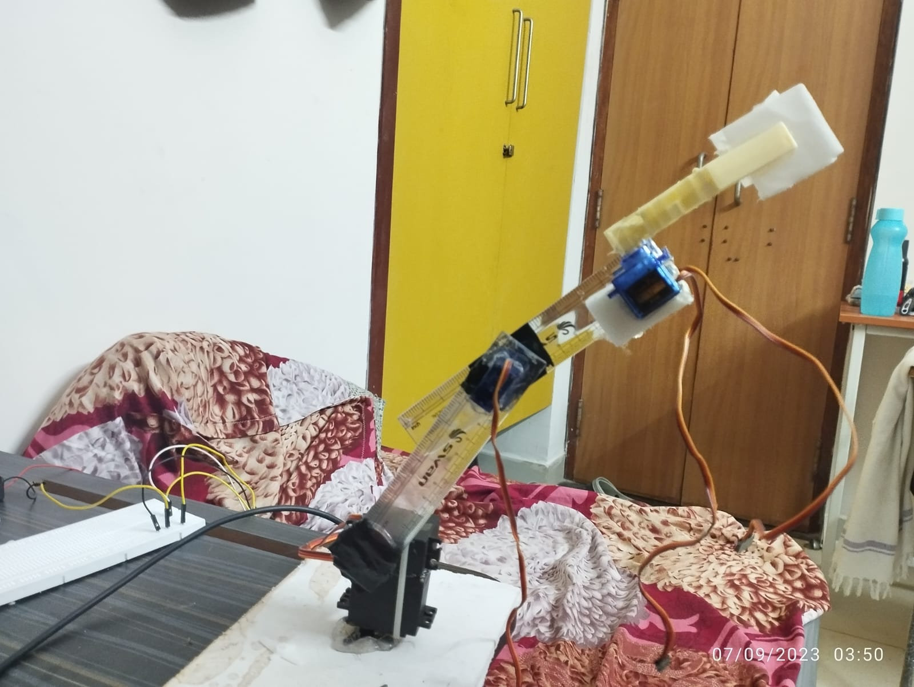
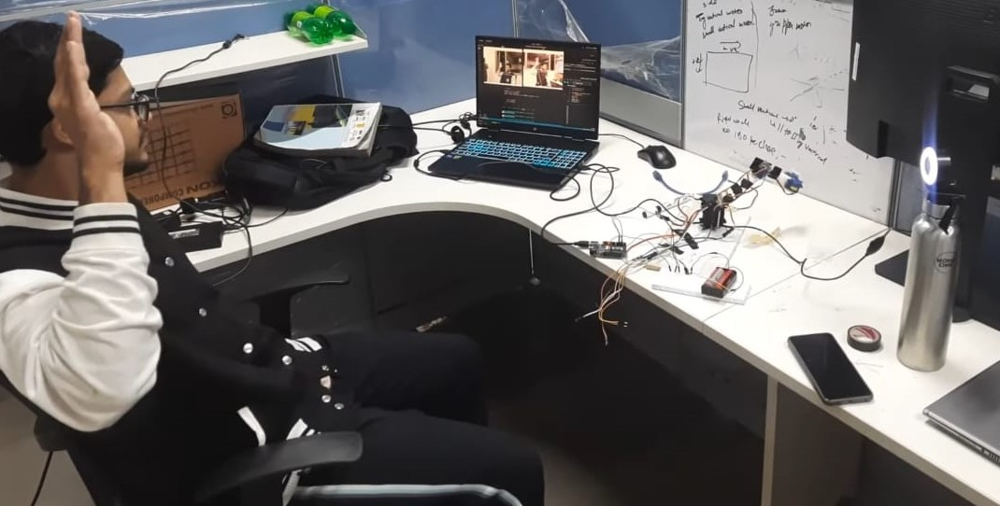
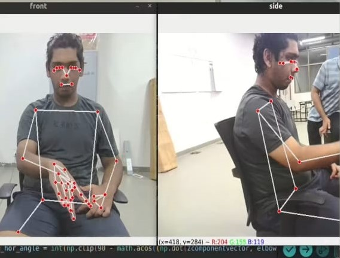

## BUILDING THE HARDWARE OF ARM
We built the hardware using micro servo motors and 2 MG996R servo motors along with plastic scales as links of the arm.
The arm has 3DOF movement and a small gripper to pick and place objects less than 100g, specifically made to demonstraate our idea of building a gesture controlled robotic arm.
The picture shows the basic model that was made:




## Microcontroller used
We used Arduino Uno for controlling the servo angles of the arm, basically it worked on serial communication between the python script where image processing took place and in that script we used CVzone library to send serial data to our arduino board.
The python script consisted of logic to give exact servo angles in real time after computing the right angles.

## CAMERA Configuration
We used 2 cameras to capture the position and estimate the angles in 3D, so one camera we used was of laptop and another one was placed towards the right perpendicularly.
The given image shows the configuration:




## Calculating Angles And Mediapipe Library
For determining the landmarks of hand and their pose in image, we used Google's Mediapipe library already trained to determine the landmarks on human body parts.
Using the 2 cameras we constructed a 3D vector space,
Using the logic of vector dot product we calculated the angle using cos inverse of dot product divided by the norm of both the vectors.
The right camera was used to determine the vector formed by the landmarks on the arm and shoulder of the person and the front camera was used to determine the vector formed by the fingers and the wrist as they were visible on the front camera.
Each individual part of the human arm depicted a link for the robotic arm and used to determine the location of the arm.
We set a refrence vector in a perpendicuar direction at each joint and then determined the inclination from that using cosine inverse and then sent that particular angle to the servo motor at that joint.
the given image shows the image feed and landmarks:




## Running the script
Install the dependencies:
```
pip install -r requirements.txt
#to run the script:
python3 run.py

```


